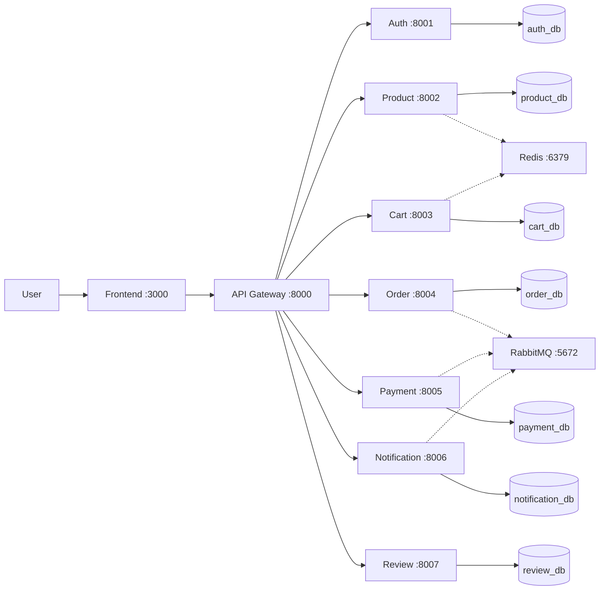

# E-commerce Microservice Project

[](LICENSE)

> Hệ thống E-commerce xây dựng theo kiến trúc Microservices và Domain-Driven Design (DDD).

> **New to this repo?** See [`GETTING_STARTED.md`](GETTING_STARTED.md) for setup instructions, workflow guide, and submission checklist.

---

## Business Process

Hệ thống cung cấp trải nghiệm mua sắm e-commerce đầy đủ:
- **Khách hàng**: Đăng nhập, tìm kiếm sản phẩm, thêm vào giỏ hàng, đặt hàng, thanh toán, và đánh giá.
- **Nhân viên (Staff)**: Quản lý sản phẩm, tồn kho, duyệt đơn hàng.
- **Admin**: Quản lý người dùng, phân quyền hệ thống.
 Hệ thống hỗ trợ tính năng behavior tracking lưu lịch sử người dùng để phục vụ phân tích dữ liệu và AI suggest.

---

## Architecture



| Component | Port | Database | Responsibility |
|-----------|------|----------|----------------|
| **Frontend** | 3000 | - | ReactJS UI |
| **API Gateway** | 8000 | - | Route & auth proxy |
| **Auth Svc** | 8001 | auth_db | User & JWT |
| **Product Svc** | 8002 | product_db | Products, inventory, tracking |
| **Cart Svc** | 8003 | cart_db | Shopping cart |
| **Order Svc** | 8004 | order_db | Orders & shipping |
| **Payment Svc** | 8005 | payment_db | Payment gateways |
| **Notification Svc** | 8006 | notification_db | Email/Alerts |
| **Review Svc** | 8007 | review_db | Product ratings |

---

## Quick Start

```bash
docker compose up --build
```

Verify services:
- Gateway: `http://localhost:8000/health/`
- Products: `http://localhost:8002/api/products/`
- Frontend: `http://localhost:3000`

---

## Features

- **Tách biệt DB (Database per service)**: Đảm bảo độc lập dữ liệu theo chuẩn Microservices.
- **DDD Architecture**: Cấu trúc domain, application, infrastructure rõ ràng ở từng service.
- **Stock Lock**: Redis distributed lock chống race condition khi mua hàng.
- **Async Events**: Giao tiếp RabbitMQ (ví dụ: tạo đơn → trừ kho → thông báo).

---

## License
[MIT License](LICENSE)
